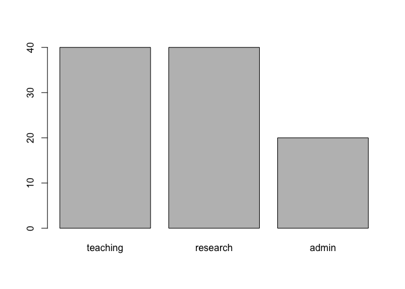
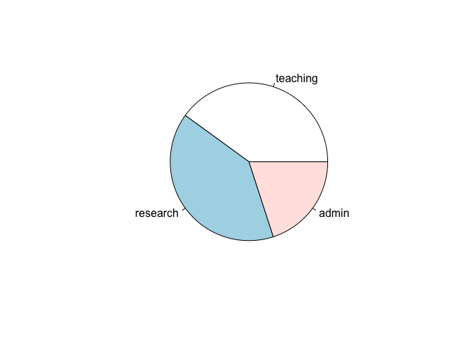
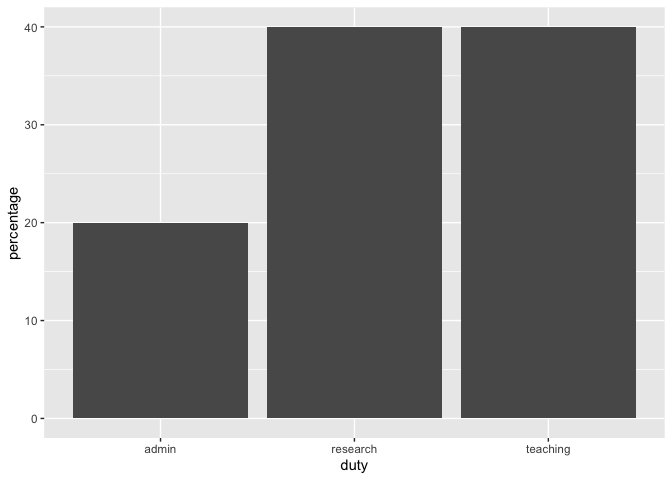
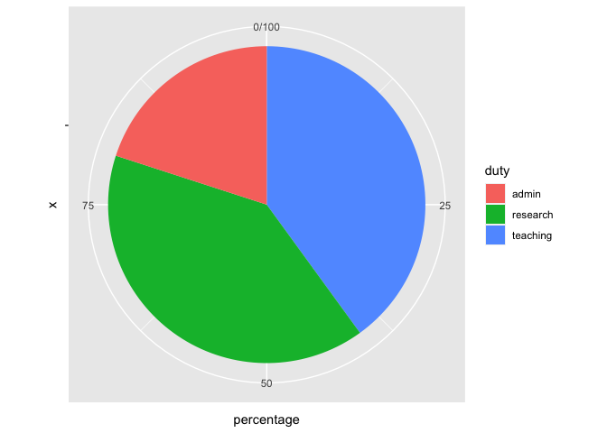

Getting the most out of your experimental data with design
================

Emi Tanaka

Department of Econometrics and Business Statistics

Monash University

Editor note: This article was originally published in the Biometric
Bulletin (2022) Volume 39 Issue.

## Introduction

Experimental data are hallmarks of proving or disproving theories or
hypotheses. Not all experimental data are of equal value however; the
design of experiment and the execution to collect data greatly shape its
downstream value. The seminal book by Fisher (1935) outline the
importance of randomisation, replication and (statistical) control in
experimental designs motivated primary by agricultural field trials.
Fisher (1935) also introduce special cases of row-column designs, such
as Latin Square and Graeco-Latin Square designs, factorial designs and
the analysis of experimental data using analysis of variance (ANOVA),
$t$-test, $\chi^2$-test and other tests of significance. Montgomery
(2001), Box, Stuart Hunter, and Hunter (2005), and Hinkelmann and
Kempthorne (2005) are classical textbooks in experimental designs taught
in many courses in experimental design. Many of these textbooks, and the
teaching of experimental designs, I would argue is focussed on
statistical aspects, but in practice, the primary problem in carrying
out an experiment is actually centered on human aspects. Consider the
following simplified scenario:

- the **domain expert** wants an experiment to validate their hypothesis
  and needs a statistician to design the experiment;
- the **statistician** elicits the experimental aim and structure from
  the domain expert and then design the experiment accounting
  appropriately for statistical issues and practical constraints;
- the **technician** carries out the experimental protocol as directed
  by the experimental design generated by the statistician and enter the
  data; and then
- the **analyst** (who may or may not be the same person as the
  statistician) interprets the experimental aim and design to
  appropriately analyse the data.

How many people were involved in this experiment? Notice that we are
reliant on communication between people, who likely have different
discipline backgrounds, to transfer the correct information in order to
successfully carry out the experiment. We know human communication is
fraught with challenges; ***misunderstandings are common, not the
exception***. The unwritten assumption in experimental designs is that
all parties involved in the experiment completely understood each other
– the statistician understood all the intricacies that the domain expert
knows that may affect the experimental outcome, and the technician will
carry out the experiment exactly as the design of experiment with no
possible error. This assumption is in contrary to what we know about
human communication; human communication is a noisy process. What then
can we do to mitigate errors in the process?

## The grammar of experimental designs

The so-called “The Grammar of Experimental Designs” is the title of my
work-in-progress book found at
[emitanaka.org/edibble-book](https://emitanaka.org/edibble-book). More
details can be found in the book, but briefly, the **grammar of
experimental designs** is an object oriented programming system designed
to capture elements of the origin of an experimental data encapsulated
in a cognitive framework. It is an attempt to standardise the
computational description of experimental components by fundamental
terms so we are not lost in domain-specific jargon.

The motivation of the grammar of experimental designs is best explained
by an analogy to the “grammar of graphics” (Wilkinson 2005) with its
most popular implementation as ggplot2 (Wickham 2016) in the R language
(R Core Team 2021). When we specify a plot, we can specify using a
complete recipe. For example, the functions `barplot()` and `pie()`
create a barplot and a pie chart, respectively, in the base R language –
these functions are for a single purpose, nothing more.

``` r
data <- data.frame(duty = c("teaching", "research", "admin"),
                   percentage = c(40, 40, 20))

barplot(data$percentage, names.arg = data$duty)
```



``` r
pie(data$percentage, labels = data$duty)
```



When we specify plots using ggplot2, the system requires users to
*specify components of the plot*, not the full plot. This not only gives
greater control over the construction of the plot but it encourages the
user to think about the relationship between data to plot elements. For
example, below we create the pie chart and barplot using ggplot2. The
first specification in ggplot2 is to initiate the object by `ggplot()`
where the user can specify the data and the mapping of variable to plot
aesthetic, then the user can append a layer like `geom_col()` to create
a barplot. To construct a pie chart in ggplot2, the user must transform
the default Cartesian coordinate system to a polar coordinate along one
of the axis.

``` r
library(ggplot2)
# bar plot
ggplot(data, aes(x = duty, y = percentage)) +
  geom_col() 
```



``` r
# pie chart
ggplot(data, aes(x = "", y = percentage, fill = duty)) +
  geom_col() + 
  coord_polar("y")
```



The ggplot2 system has a steep learning curve, however, the mastery of
the system allows users to easily create a variety of plots. In a
similar vein, the grammar of experimental designs is a system to
construct experimental designs by experimental components – the users
don’t need to specify the complete design but build up the experimental
design by its basic components, like experimental units and treatments,
giving them the flexibility in their thinking and specifciation of the
experimental structure. The easiest way to grasp the grammar of
experimental design is to see examples of its implementation as shown
next.

## Constructing experimental designs with the **edibble** R package

The edibble package is a system in the R language to facilitate the
design of comparative experiments based on the grammar of experimental
designs. The package is available on Comprehensive R Arhive Network
(CRAN) with the developmental version available at
[github.com/emitanaka/edibble](https://github.com/emitanaka/edibble) and
can be installed as below.

``` r
# installing from CRAN
install.packages("edibble") 
# OR for the developmental version
install.packages("remotes") 
remotes::install_github("emitanaka/edibble") 
```

### Package name

The name of the package, edibble, stands for the **e**xperimental
**d**esign table or t**ibble** for those that are familiar with
tidyverse (Wickham et al. 2019). I often see people misspell it as
eddible or edible (latter probably due to autocorrect), so I want to
emphasise that is is edibble, i.e. one d and two b.

The package name itself relates to the aim of what it tries to produce,
i.e. a table where columns specifies the unit and treatment factors in
the experimental design and rows specify the characteristics of the
observational unit, including the allocated treatment.

### Example usage

Let’s suppose that we want to create a randomised complete block design
(RCBD) with 6 blocks with 3 plots in each block to test 3 wheat
varieties, labelled A, B and C. As not all of you may know what a RCBD
is, to describe it more explicitly, the treatments (in this case the 3
wheat varieties) are randomly allocated to one of the plot (experimental
unit) within a block; only one treatment level can be assigned to each
plot; and each treatment level must appear exactly once in each block.
The specification of this design in the edibble system is shown below
and can be interpreted as follows:

- Line 1: load the library,
- Line 2: set the seed to ensure replication of the randomised design,
- Line 3: initialise the design object,
- Line 4-5: set the unit factors, namely 6 blocks and 3 plots nested in
  each block,
- Line 6: set the treatment factor, variety, with 3 levels (A, B, and
  C),
- Line 7: specify the high-level treatment to unit allocation,
- Line 8: assign the treatment randomly, and
- Line 9: the design specification is complete, now convert the result
  to a table.

``` r
library(edibble)
set.seed(2022) 
design("Randomised Complete Block Design") %>% 
  set_units(block = 6,
            plot = nested_in(block, 3)) %>% 
  set_trts(variety = c("A", "B", "C")) %>% 
  allot_trts(variety ~ plot) %>% 
  assign_trts("random") %>% 
  serve_table()
```

    # Randomised Complete Block Design 
    # An edibble: 18 x 3
           block       plot  variety
       <unit(6)> <unit(18)> <trt(3)>
     1    block1     plot1         A
     2    block1     plot2         B
     3    block1     plot3         C
     4    block2     plot4         A
     5    block2     plot5         B
     6    block2     plot6         C
     7    block3     plot7         A
     8    block3     plot8         C
     9    block3     plot9         B
    10    block4     plot10        C
    11    block4     plot11        B
    12    block4     plot12        A
    13    block5     plot13        B
    14    block5     plot14        C
    15    block5     plot15        A
    16    block6     plot16        C
    17    block6     plot17        B
    18    block6     plot18        A

Above table output shows the resulting allocation of the treatment to
units, e.g. from the first row we see that first plot in the first block
is assigned variety A.

Now consider the design specified below. How is this different to above?

``` r
design("Do exam type matter?") %>% 
  set_units(school = 6,
            student = nested_in(school, 3)) %>% 
  set_trts(exam = c("Oral", "Written", "Computer")) %>% 
  allot_trts(exam ~ school) %>% 
  assign_trts("random") %>% 
  serve_table()
```

    # Do exam type matter? 
    # An edibble: 18 x 3
          school    student     exam
       <unit(6)> <unit(18)> <trt(3)>
     1   school1  student1  Oral    
     2   school1  student2  Oral    
     3   school1  student3  Oral    
     4   school2  student4  Computer
     5   school2  student5  Computer
     6   school2  student6  Computer
     7   school3  student7  Oral    
     8   school3  student8  Oral    
     9   school3  student9  Oral    
    10   school4  student10 Written 
    11   school4  student11 Written 
    12   school4  student12 Written 
    13   school5  student13 Computer
    14   school5  student14 Computer
    15   school5  student15 Computer
    16   school6  student16 Written 
    17   school6  student17 Written 
    18   school6  student18 Written 

First, you may have noticed that the experimental factors are named
differently. The names that you enter in `set_units()` and `set_trts()`
are not fixed by the system – the user may enter the name that is
appropriate for their experimental context. These are just simply labels
but it captures the valuable experimental context. In fact, the unit
structure is exactly the same as the previous experiment! But it’s easy
to see that the first experiment is a wheat variety trial but the second
experiment is comparing the exam type across schools.

Second, aside from labels, you may have noticed everything is the same
as the previous experiment except line 5. The treatment (exam type) are
randomly allocated to schools, not individual students within a school.
You can see this in the resulting table output – each school gets only
one type of exam. The resulting design is in fact called a completely
randomised design. Here, the experimental units are the schools and the
intended observational units are the students.

You may think the edibble system is only for balanced designs (where
there is equal number of units within a block), but you can easily
specify unbalanced designs as shown in line 3-5 below where there are
two blocks (labelled I and II) where block I has 3 plots and block II
has 6 plots.

``` r
design("Unbalanced design") %>% 
  set_units(block = c("I", "II"),
            plot = nested_in(block, 
                              "I" ~ 3,
                             "II" ~ 6)) %>% 
  set_trts(variety = c("A", "B", "C")) %>% 
  allot_trts(variety ~ plot) %>% 
  assign_trts("random") %>% 
  serve_table()
```

    # Unbalanced design 
    # An edibble: 9 x 3
          block      plot  variety
      <unit(2)> <unit(9)> <trt(3)>
    1        I      plot1        B
    2        I      plot2        A
    3        I      plot3        C
    4        II     plot4        C
    5        II     plot5        A
    6        II     plot6        B
    7        II     plot7        C
    8        II     plot8        B
    9        II     plot9        A

There are more features in the edibble system. These features include
setting responses using `set_rcrds()`, simulating responses with
`simulate_rcrds()` (experimental only), and setting expectation of
responses `expect_rcrds()`, e.g. when values should be positive numbers
only. The latter allows files to be encoded with data validation rules,
e.g. `export_design()` outputs the edibble table as an Excel file where
values outside of expectation cannot be entered by exploiting Excel’s
data validation system.

The edibble system has been designed so that developers can extend the
system. If the `assign_trts()` is not suitable, then you can replace
this with an alternative one. Likewise, if an Excel output is not
desired then you can replace the exporting system with another system.
The system exposes its components as modular functions to allow
extensibility. The caveat of the edibble system is that there is a steep
learning curve for both the user and the developer – but mastery of the
grammar should help you flexibly specify a variety of experimental
designs and deepen your thinking about the experimental design.

## Recipe experimental designs

> “Good design considers units and treatments first, and then allocates
> treatments to units. It does not choose from a menu of named designs.”
> – Bailey (2008)

I highly discourage the use of named experimental designs, but I
acknowledge that the literature is littered with them. The compromise I
have made is to include a set of functions that are prefixed with
`menu_`. For example, below `menu_rcbd()` shows the code to generate a
RCBD with 3 treatments and 6 blocks. If you must take this approach, I
suggest that you copy the output code and replace the generic factor
names with what is appropriate in the context of your own experiment.

``` r
menu_rcbd(t = 3, r = 6)
```

    design("Randomised Complete Block Design") %>%
      set_units(block = 6,
                unit = nested_in(block, 3)) %>%
      set_trts(trt = 3) %>%
      allot_trts(trt ~ unit) %>%
      assign_trts("random", seed = 424) %>%
      serve_table()

If you want to actually see a table output then you can `takeout()` any
named design (on the menu). Say below `menu_lsd()` shows the code for
generating a Latin Square design; the `takeout()` of this design on the
menu shows the table output of the Latin Square design with 4
treatments.

``` r
takeout(menu_lsd(t = 4))
```

    design("Latin Square Design") %>%
      set_units(row = 4,
                col = 4,
                unit = crossed_by(row, col)) %>%
      set_trts(trt = 4) %>%
      allot_trts(trt ~ unit) %>%
      assign_trts("random", seed = 794) %>%
      serve_table() 

    # Latin Square Design 
    # An edibble: 16 x 4
             row       col       unit      trt
     * <unit(4)> <unit(4)> <unit(16)> <trt(4)>
     1      row1      col1     unit1      trt1
     2      row2      col1     unit2      trt3
     3      row3      col1     unit3      trt4
     4      row4      col1     unit4      trt2
     5      row1      col2     unit5      trt4
     6      row2      col2     unit6      trt2
     7      row3      col2     unit7      trt1
     8      row4      col2     unit8      trt3
     9      row1      col3     unit9      trt3
    10      row2      col3     unit10     trt4
    11      row3      col3     unit11     trt2
    12      row4      col3     unit12     trt1
    13      row1      col4     unit13     trt2
    14      row2      col4     unit14     trt1
    15      row3      col4     unit15     trt3
    16      row4      col4     unit16     trt4

The full list of available named experimental designs can be found in
the [Cookbook chapter in The Grammar of Experimental Designs
book](https://emitanaka.org/edibble-book/cookbook.html).

## Conclusion

The design of an experiment is, without a doubt, of critical importance
in the advancement of our knowledge. In fact, a good experimental design
and well executed collection of data can eliminate or reduce the
necessity of certain statistical analysis. The use of experimental
designs in practice are arguably propagated by statistical software and
interested readers can see Tanaka and Amaliah (2022) for a review of
popular R packages in experimental design. The edibble R package is an
attempt to specify designs by a paradigm that is flexible, yet
human-centered. By building designs based on its components, users are
required to think about the ingredients that make up the composition of
the experimental structure – this system design I would hope translates
to higher order thinking about experimental designs.

This article did not touch on much about optimal, adaptive, model-based
nor domain-specific designs. The scope of work in the design of
experiments is large and substantial work remain to bridge the gap
between the principles and practice of experimental designs. Too often,
teaching of experimental design is overshadowed by the analysis of
experimental data and to get the most out of experimental data, we
should remember that experimental context is invaluable in the design
and no analysis can extract information from rubbish data.

<div id="refs" class="references csl-bib-body hanging-indent">

<div id="ref-Bailey2008-gw" class="csl-entry">

Bailey, Rosemary. 2008. *Design of Comparative Experiments*. Cambridge
University Press.

</div>

<div id="ref-Box2005-yj" class="csl-entry">

Box, George E P, J Stuart Hunter, and William G Hunter. 2005.
*Statistics for Experimenters: An Introduction to Design, Data Analysis,
and Model Building*. 2nd ed. John Wiley & Sons, Inc.

</div>

<div id="ref-Fisher1935-qc" class="csl-entry">

Fisher, Ronald Aylmer. 1935. *The Design of Experiments*. Oliver; Boyd.

</div>

<div id="ref-Hinkelmann2005-jq" class="csl-entry">

Hinkelmann, Klaus, and Oscar Kempthorne. 2005. *Design and Analysis of
Experiments*. 2nd ed. Vol. 1. Wiley Blackwell.

</div>

<div id="ref-Montgomery2001-gh" class="csl-entry">

Montgomery, Doulgas C. 2001. *Design and Analysis of Experiments*. 5th
ed. John Wiley & Sons, Inc.

</div>

<div id="ref-Rstats" class="csl-entry">

R Core Team. 2021. *R: A Language and Environment for Statistical
Computing*. Vienna, Austria: R Foundation for Statistical Computing.
<https://www.R-project.org/>.

</div>

<div id="ref-tanaka2022" class="csl-entry">

Tanaka, Emi, and Dewi Amaliah. 2022. “<span class="nocase">Current state
and prospects of R-packages for the design of experiments</span>.”
arXiv. <https://doi.org/10.48550/ARXIV.2206.07532>.

</div>

<div id="ref-Wickham2016-yg" class="csl-entry">

Wickham, Hadley. 2016. *Ggplot2: Elegant Graphics for Data Analysis*.
Springer-Verlag New York.

</div>

<div id="ref-Wickham2019-mj" class="csl-entry">

Wickham, Hadley, Mara Averick, Jennifer Bryan, Winston Chang, Lucy
D’agostino McGowan, Romain Francois, Garrett Grolemund, et al. 2019.
“Welcome to the Tidyverse.” *Journal of Open Source Software* 4 (43):
1686.

</div>

<div id="ref-Wilkinson2005-oz" class="csl-entry">

Wilkinson, Leland. 2005. *The Grammar of Graphics*. 2nd ed. Springer.

</div>

</div>
